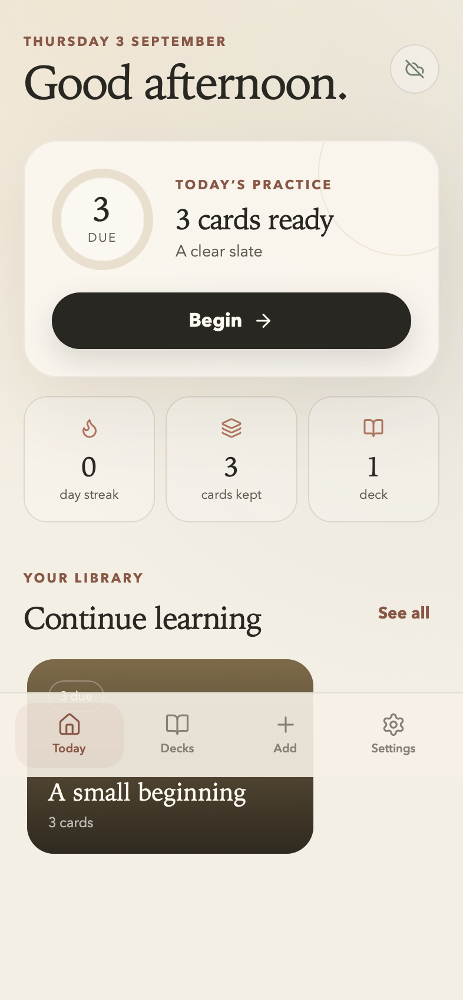

# Lumen

Lumen is a calm, private flashcard app for iPhone and the web. It uses the modern FSRS scheduler to bring each card back when it is useful—not merely every day.



## Install on iPhone

1. Open **<https://tbuckworth.github.io/lumen-cards/>** in Safari.
2. Tap **Share**, then **Add to Home Screen**.
3. Keep **Open as Web App** enabled and tap **Add**.

There is no App Store purchase, developer account, login, API key, or subscription. After the first visit, the app works offline.

## What it does

- Schedules reviews with [FSRS](https://github.com/open-spaced-repetition/ts-fsrs), with adjustable desired retention and daily new-card limits.
- Creates, edits, pauses, deletes, searches, and studies cards in separate decks.
- Displays embedded PNG, JPEG and WebP images on either side, including image-only cards, with tap-to-enlarge viewing.
- Keeps repeated prompts with different images distinct and preserves images in deck exports and full backups. See the [image-deck guide](docs/image-decks.md).
- Imports Lumen JSON, Claude's compact JSON shape, CSV, TSV, and Anki **Notes in Plain Text** exports.
- Exports Lumen decks or Anki-compatible UTF-8 tab-separated text.
- Saves a complete backup containing decks, cards, FSRS state, and review history.
- Shares a learning report containing repeatedly missed cards back to Claude through the iPhone share sheet.
- Installs as a standalone PWA and precaches the complete interface for offline use.

## Claude and reMarkable workflow

The `paper-review` plugin in [`tbuckworth/claude-remote-setup`](https://github.com/tbuckworth/claude-remote-setup) includes a `lumen-flashcards` skill and `/lumen-deck` command. It turns a paper, reMarkable annotations, quiz gaps, or notes into a validated `*.lumen.json` file.

The low-friction route is:

1. Review a paper with Claude and reMarkable, or say **“Make this a Lumen deck.”**
2. Claude saves the deck in **iCloud Drive → Lumen Inbox** when available.
3. On iPhone, open **Lumen → Add → Import → Choose a deck file**.
4. Later, use **Settings → Share progress with Claude** so Claude can diagnose weak or ambiguous cards.

This exchange is deliberately user-mediated. Lumen cannot read Claude conversations and Claude cannot silently read Lumen's local data.

## Data and privacy

Cards and review history live in IndexedDB on the current device and origin. Lumen asks the browser for persistent storage but browsers retain final control, so full backups matter. Use **Settings → Save a full backup** and keep the JSON file in iCloud Drive before changing or resetting a phone.

There is no analytics, advertising, remote database, account system, or application secret. The static site is public; the user's cards are not.

### Current boundaries

- No automatic cross-device sync. That would require accounts and a maintained backend, which conflicts with the free, zero-maintenance first version.
- No server-driven reminders. iPhone web push requires a push service; opening Lumen shows everything due.
- No direct `.apkg` parser. In Anki, export **Notes in Plain Text**, then import the resulting `.txt` file into Lumen. Lumen can export the same documented text format back to Anki.
- Audio and direct HEIC/SVG/GIF imports are not supported. Images use embedded PNG, JPEG or WebP in Lumen JSON; Anki text export cannot carry these images.

## Development

Requires Node.js 20.19 or newer.

```bash
npm ci
npm run dev
```

Run the complete local verification:

```bash
npm test
npm run build
npm run test:e2e
```

The Playwright suite covers emulated iPhone WebKit, mobile Chromium, and desktop Chromium. It tests onboarding, FSRS review, persistence, Claude deck import, the PWA manifest, offline reload in browsers whose automation layer supports it, and automated accessibility checks.

Pull requests and pushes to `main` run the same tests; pushes to `main` build a downloadable release artifact and deploy `dist/` to GitHub Pages only after they pass.

## Design notes

The palette is parchment, sandstone, low amber, sage, and ink. Typography uses system-resident Baskerville/Iowan-style faces and Avenir fallbacks, so the app remains fast and fully offline without a font CDN.

Lumen is not affiliated with Anki. FSRS and `ts-fsrs` are open-source projects used under their respective licences.
